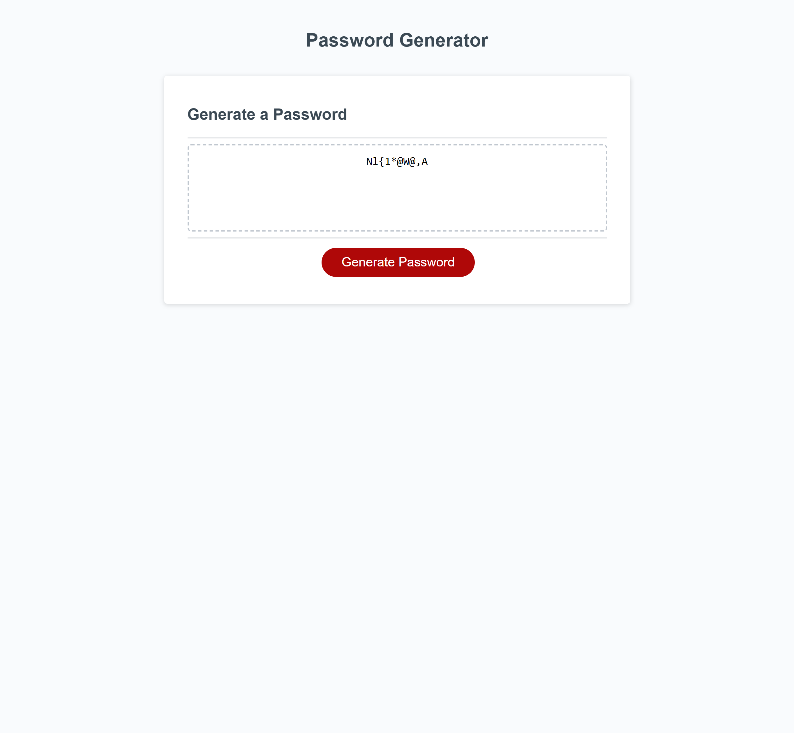

# Password-Generator

## Description 
The project was designed so that we can generate a random password based on the users choices of the following options: lenght of password (8-128), uppercase, lower case letters, numbers and special characters. 

## Screenshot

## link
https://arniezzy.github.io/Password-Generator/